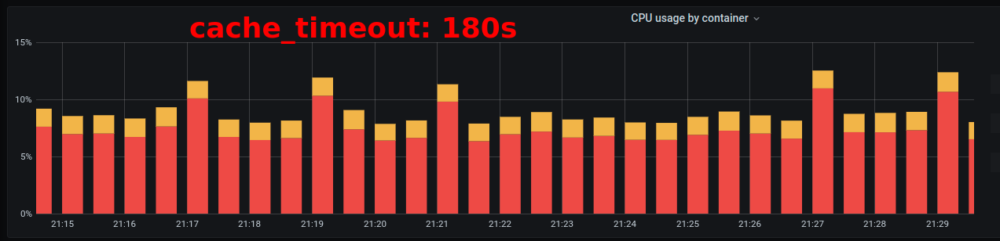
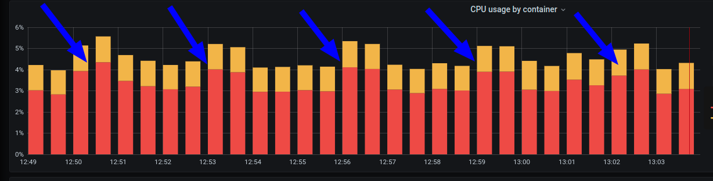

### Projector HW 4
### Use probability cache
## Usage

### RUN  services
```
make run
``` 
If you want to use probability cache, 
set env value `USE_PROBABILISTIC_CACHE: "true"` 
in `docker-compose.yml`

###To rum Siege
```
make siege
```
It will run siege and use urls.txt file in this repo

###Without probabilistic cache:
```
Lifting the server siege...
Transactions:                 141181 hits
Availability:                 100.00 %
Elapsed time:                 561.12 secs
Data transferred:              35.23 MB
Response time:                  0.00 secs
Transaction rate:             251.61 trans/sec
Throughput:                     0.06 MB/sec
Concurrency:                    1.12
Successful transactions:      141181
Failed transactions:               0
Longest transaction:            0.05
Shortest transaction:           0.00
```

###Without probabilistic cache:
```
Transactions:                 451063 hits
Availability:                 100.00 %
Elapsed time:                2507.76 secs
Data transferred:             613.19 MB
Response time:                  0.00 secs
Transaction rate:             179.87 trans/sec
Throughput:                     0.24 MB/sec
Concurrency:                    0.48
Successful transactions:      450301
Failed transactions:               0
Longest transaction:            0.40
Shortest transaction:           0.00
```

### Without probability cache
We see strong high value peak of load postgres



when we use probability cache the peak blured


