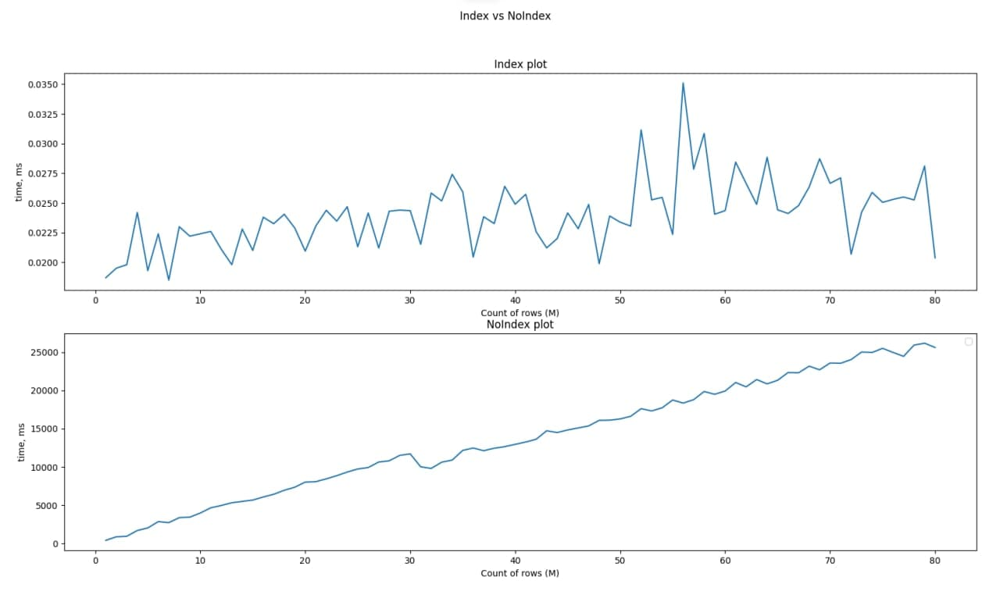

### Projector HW 8
### Index vs noIndex
## Usage

### RUN  services
```
make run
``` 
After it in folder `app` will create file `app/avr_time.csv`.
You can build plot base on this file and run `python3 main_plot`

### Example of graph

